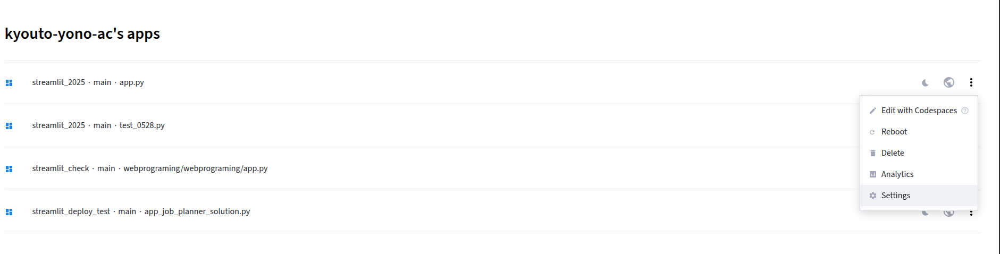
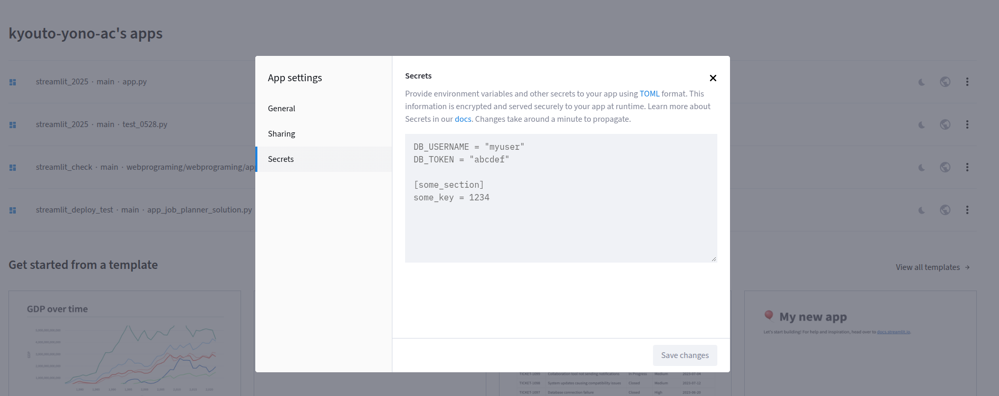

<!-- _class: lead -->

# 第13回
## 最終課題演習(1)
### テーマ選定・設計・制作開始

**総合的なWebアプリケーション開発**

出席認証コード: **4899**

---

## 📋 3回構成の概要

| 回 | 内容 | 主要目標 |
|-----|------|----------|
| **第13回** | テーマ選定・設計・制作開始 | 📋 企画・設計・開発着手 |
| **第14回** | 制作完成・デプロイ | 🚀 完成・公開・動作確認 |
| **第15回** | 発表・相互評価・まとめ | 🎤 発表・評価・振り返り |

提出期限：第15回の授業開始（ギリギリに提出するとサポートできない可能性があるので気をつけてください。）
※中間と同じようにデプロイして、アプリの説明のシートを記入してください。


---

## 🎯 最終課題の目標

### 総合的なWebアプリケーション開発
これまで学んだ**すべての技術**を統合して、実用的なWebアプリケーションを作成

### 習得技術の統合
- **Streamlit基礎**: UI/UX設計、レイアウト、状態管理
- **データ処理**: Pandas、CSV操作、データ可視化
- **AI活用**: Gemini API、プロンプトエンジニアリング
- **デプロイ**: GitHub連携、Web公開

---

## 📊 評価基準

### 4つの評価項目

| 項目 | 評価内容 |
|------|----------|
| **機能性** | 要求機能の実装度、技術要素の活用 |
| **UI/UX** | 使いやすさ、見た目の美しさ |
| **独創性** | アイデアの面白さ、工夫の程度 |
| **完成度** | バグの少なさ、動作の安定性 |


---

## 🎨 テーマ選択

### 【自由テーマ】を基本とします
- **自分の興味・関心**に合わせて自由にテーマを設定
- **実際に使いたいアプリ**を考えて制作
- **これまでの学習内容**を活用した実用的なアプリ

### 技術要件（以下のいずれか）
- **Streamlit基礎**
- **Streamlit基礎 + データ処理・可視化**
- **Streamlit基礎 + AI活用（Gemini API）**
- **Streamlit基礎 + データ処理・可視化 + AI活用**

---
### 【テンプレート例】
どうしても思いつかない場合は、以下のテンプレートを参考に：

#### データ分析・可視化系
- **美容・コスメ商品比較ダッシュボード** (`app_cosmetic_dashboard.py`)
  - CSVファイルからコスメ商品データを読み込み、フィルタリング・可視化・分析機能を持つダッシュボード
  - サイドバーでフィルタ、タブ分けして表示

#### AI活用系
- **パーソナル学習アシスタント** (`app_learning_assistant.py`)
  - Gemini APIを活用した学習プラン作成・質問応答・進捗管理機能
  - session_stateで学習履歴管理、tabsで機能分け

- **パーソナル健康管理ダッシュボード** (`app_health_dashboard.py`)
  - 健康データの記録・分析とGemini APIによる健康アドバイス
  - session_stateで健康データ管理、formでデータ入力

**まずは自分のアイデアを考えてみましょう！**

---

## 💡 テーマ案

### 📊 データ処理・可視化系
| テーマ | 概要 | 主要機能 |
|--------|------|----------|
| **家計簿・支出管理アプリ** | 学生の支出パターンを分析 | カテゴリ別分析、月別トレンド、予算管理 |
| **勉強時間・成績管理** | 学習時間と成績の相関分析 | 科目別分析、目標設定、進捗可視化 |
| **読書記録・本管理** | 読書習慣の可視化と分析 | ジャンル別分析、読書ペース、評価管理 |
| **運動・健康記録** | 運動データの記録と分析 | 体重変化、運動時間、目標達成度 |
| **アルバイト・時間管理** | 働く時間と収入の分析 | 時給分析、月収予測、シフト管理 |

### 🤖 AI活用系
| テーマ | 概要 | 主要機能 |
|--------|------|----------|
| **学習アシスタント** | 勉強をサポートするAI | 学習計画作成、質問応答、要点整理 |
| **悩み相談チャットボット** | 学生の悩みに寄り添うAI | カテゴリ別相談、アドバイス、心理サポート |
| **推し活アドバイザー** | 推し活を効率化するAI | イベント計画、予算管理、情報整理 |
| **美容・コスメ相談** | 美容に関するAIアドバイザー | 肌質診断、コスメ推薦、美容相談 |
| **進路・就職相談** | キャリアサポートAI | 自己分析、面接練習、業界情報 |

---

## 🎯 テーマ選定のコツ

### 1. 自分の興味・関心を最優先
- **好きなこと・趣味**: 推し活、美容、健康、学習など
- **困っていること**: 日常の課題を解決するアプリ
- **使いたいアプリ**: 実際に自分が使いたいと思うもの

### 2. 技術レベルに合わせて選択
- **基本を確実に**: データ処理・可視化から始める
- **新しい挑戦**: AI機能を取り入れてみる
- **統合的な開発**: データ分析とAIを組み合わせる

### 3. 完成可能性を考慮
- **確実に完成**: 慣れ親しんだ技術を中心に
- **段階的な開発**: 基本機能から始めて徐々に追加
- **時間管理**: 2回の授業で完成できる範囲で

---

## 💡 制作開始のポイント

### 1. 段階的な開発
```python
# Step 1: 基本レイアウトの作成
st.title("🎯 あなたのアプリ名")
st.sidebar.header("🔧 設定")

# Step 2: データの読み込み・表示
df = pd.read_csv("data.csv")
st.dataframe(df)

# Step 3: 基本機能の実装
# 各テーマに応じた核となる機能

# Step 4: UI/UXの改善
# 見た目の調整、操作性の向上
```

### 2. 提供されるファイル
- **テンプレート例**: アイデアが思いつかない場合の参考例
- **CSVデータ**: テンプレート例で使用するサンプルデータ

---

## 🔐 Gemini API キーの適切な管理

### ⚠️ 重要：APIキーをコードに埋め込まない

```python
# ❌ 絶対にダメ：コードに直接書かない
genai.configure(api_key="AIzaSyBxxxxxxxxxxxxxxxxxxxxxxx")

# ✅ 正しい方法：Secretsまたはユーザー入力から取得
api_key = st.secrets["GEMINI_API_KEY"]  # Secretsから
# または
api_key = st.text_input("Gemini API Key", type="password")  # ユーザー入力
```

### 📋 推奨される方法

#### 方法1：Streamlit Community Cloud Secrets
- **メリット**: セキュアで管理しやすい
- **用途**: 自分専用のアプリ
- **設定方法**: 次のスライドで詳しく説明

#### 方法2：ユーザー入力
- **メリット**: 複数ユーザーが各自のAPIキーを使用
- **用途**: 他の人も使うアプリ

---

## 🔐 Streamlit Community Cloud Secrets 設定方法

### セキュアなAPIキー管理

#### 設定手順

### 1. アプリの設定画面を開く



- アプリのダッシュボードから「Settings」をクリック
- 左メニューから「Secrets」を選択
---
### 2. APIキーをSecretsに登録する



---

- TOML形式でAPIキーを記述
```toml
GEMINI_API_KEY = "your_actual_api_key_here"
```
- 「Save changes」をクリックして保存


### 3. コードでSecretsを使用する

```python
import streamlit as st
import google.generativeai as genai

# SecretsからAPIキーを取得
api_key = st.secrets["GEMINI_API_KEY"]
genai.configure(api_key=api_key)

# 通常のアプリ処理
st.title("学習アシスタントアプリ")
```

### 📋 メリット
- **セキュリティ**: APIキーがコードに露出しない
- **管理性**: 一箇所でAPIキーを管理
- **利便性**: 毎回入力する必要がない
- **プライバシー**: 個人専用のAPIキーを使用

---

## 👥 ユーザー入力でのAPIキー管理

### 実装例：ユーザーがAPIキーを入力する方法


```python
import streamlit as st
import google.generativeai as genai

st.title("学習アシスタントアプリ")

# APIキー入力
api_key = st.text_input(
    "Gemini API キーを入力してください:",
    type="password",
    help="Google AI StudioでAPIキーを取得してください"
)

if api_key:
    genai.configure(api_key=api_key)
    
    # 質問入力エリア
    question = st.text_area("質問を入力してください")
    
    if st.button("質問する"):
        if question:
            model = genai.GenerativeModel('gemini-2.0-flash-lite')
            response = model.generate_content(question)
            st.write(response.text)
        else:
            st.warning("質問内容を入力してください")
else:
    st.warning("Gemini API キーを設定してください。")
```


### 🚨 絶対に避けるべきこと

- ❌ GitHubなどのリポジトリにAPIキーをコミット
- ❌ コードに直接APIキーを書く

---

## 🛠️ 開発環境の準備

### 必要なライブラリ
```bash
pip install streamlit pandas plotly google-generativeai
```

### プロジェクト構造
```
your-project/
├── app.py              # メインアプリファイル
├── data/               # データファイル
│   ├── cosmetic_products.csv
│   ├── health_tips.csv
│   └── learning_resources.csv
├── .streamlit/
│   └── secrets.toml    # APIキー（ローカル用）※直接アップロードは絶対しない！
└── requirements.txt    # 依存ライブラリ
```

### APIキーの設定（Gemini API使用時）
```toml
# .streamlit/secrets.toml
GEMINI_API_KEY = "your_api_key_here"
```

---

## 🎯 今日の授業の流れ

### タイムスケジュール
| 時間 | 内容 |
|------|------|
| 00:00-00:10 | 課題説明・テーマ紹介 |
| 00:10-00:20 | テーマ選定・設計 |
| 00:20-01:05 | 制作開始・実装 |
| 01:05-01:25 | **学生同士のフィードバック** |
| 01:25-01:30 | 進捗確認・次回予告 |

### 本日の成果物
- **選定したテーマ**: 自分のアプリのテーマ決定
- **相互フィードバック**: 他の学生からの意見・アドバイス

### フィードバック時間（01:05-01:25）
- **フィードバックシート**: https://forms.gle/m4Qrq28vFhWmNVWE9
- **ペア・グループ**: 近くの学生と2-3人組でフィードバック
- **内容**: テーマ、設計、進捗状況について意見交換

---

## 📞 サポート・質問

### 授業中のサポート
- **個別質問**: 直接聞いてください。

### 授業外のサポート
- [ manabaの掲示板](https://otsuma.manaba.jp/ct/course_1995207_topics_5_tflat): ソースコードやエラー画面の画像を貼り付けて質問してください

---

## 📝 授業アンケートのお願い

### 授業評価アンケートの実施
- **実施場所**: **UNIPA**の授業評価画面
- **所要時間**: **約10分**で完了

