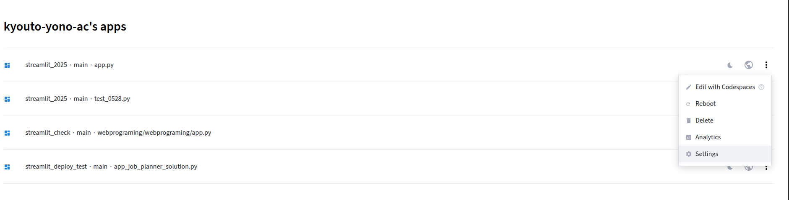
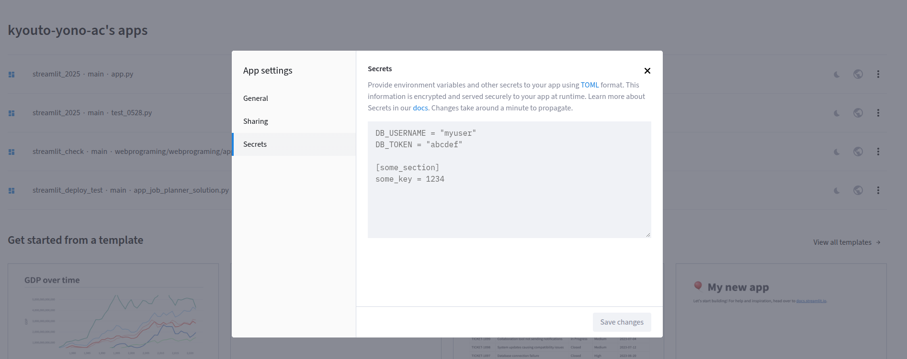

<!-- _class: lead -->

# 第14回
## 最終課題演習(2)
### 制作完成・デプロイ

**アプリを完成させ、世界に公開しよう！**

出席認証コード: **4495**

---

## 📋 本日の目標

1. **機能完成**: 前回から続けて、アプリの機能を完成させる
2. **UI/UX改善**: 使いやすさと見た目を向上させる
3. **デプロイ**: GitHubアップロード → Streamlit Community Cloudでの公開
4. **動作確認**: 公開されたアプリの動作テスト・バグ修正

---

## 🎯 今日の授業の流れ

### タイムスケジュール
| 時間 | 内容 |
|------|------|
| 00:00-00:05 | 前回の進捗確認・本日の目標説明 |
| 00:05-01:00 | 制作の続行・機能完成 |
| 01:00-01:10 | UI/UX改善・最終調整 |
| 01:10-01:20 | GitHubアップロード・デプロイ |
| 01:20-01:25 | 動作確認・バグ修正 |
| 01:25-01:30 | 次回準備・まとめ |

### 本日の成果物
- **完成したアプリ**: 全機能が動作するアプリ
- **公開URL**: 誰でもアクセスできるWebアプリ
- **発表準備**: 次回の発表に向けた準備完了

---

## ✅ 機能完成のチェックリスト

### 基本機能
- [ ] **メイン機能**: 選択したテーマの核となる機能が動作
- [ ] **データ処理**: CSVファイルの読み込み・表示が正常
- [ ] **グラフ表示**: Plotlyでのグラフが適切に表示
- [ ] **AI機能**: （該当する場合）AIの応答が適切

### エラーハンドリング
- [ ] **ファイル不存在**: データファイルが見つからない場合の処理
- [ ] **データエラー**: データの異常値に対する処理
- [ ] **API エラー**: （AI使用時）API呼び出しエラーの処理
- [ ] **ユーザー入力**: 不正な入力値に対する処理

### 動作確認
- [ ] **全機能テスト**: すべての機能が期待通りに動作
- [ ] **エラーなし**: コンソールにエラーメッセージが表示されない
- [ ] **レスポンス**: 操作に対する適切な応答速度

---

## 🎨 UI/UX改善のテクニック

### 1. 美しいページ設定
```python
st.set_page_config(
    page_title="あなたのアプリ名",
    page_icon="🎯",
    layout="wide",
    initial_sidebar_state="expanded"
)
```

### 2. 効果的なレイアウト
```python
# タイトルと説明
st.title("🎯 あなたのアプリ名")
st.markdown("---")
st.info("💡 このアプリの使い方をここに書きます")

# タブによる機能分割
tab1, tab2, tab3 = st.tabs(["📊 分析", "📈 グラフ", "🤖 AI"])
```

### 3. 適切なメッセージ表示
```python
st.success("✅ 処理が完了しました！")
st.warning("⚠️ 注意：この操作は時間がかかる場合があります")
st.error("❌ エラーが発生しました")
st.info("💡 ヒント：この機能の使い方")
```

---

## 🎨 UI/UX改善のポイント

### サイドバーの活用
```python
with st.sidebar:
    st.header("🔧 設定")
    # 設定項目をここに配置
    
    st.header("ℹ️ 情報")
    st.markdown("**作成者**: あなたの名前")
    st.markdown("**バージョン**: 1.0")
```

### プログレス表示
```python
with st.spinner("データを処理中..."):
    # 時間のかかる処理
    time.sleep(2)
    
# プログレスバー
progress_bar = st.progress(0)
for i in range(100):
    progress_bar.progress(i + 1)
    time.sleep(0.01)
```

### 視覚的な改善
```python
# カラムレイアウト
col1, col2, col3 = st.columns(3)
with col1:
    st.metric("総売上", "1,234,567円", "12%")
with col2:
    st.metric("注文数", "123件", "3件")
with col3:
    st.metric("平均単価", "10,037円", "-2%")
```

---

## 🚀 GitHubアップロード手順

### 1. リポジトリの準備
1. **GitHub.com**で新しいリポジトリを作成
   - リポジトリ名: `final-project-streamlit`（または適切な名前）
   - **Public設定**
   - 「Add a README file」にチェック

### 2. 必要ファイルの準備
```
your-project/
├── app.py              # メインアプリファイル
├── requirements.txt    # 依存ライブラリ
├── data/              # データファイル（必要に応じて）
│   └── your_data.csv
└── README.md          # プロジェクト説明
```

### 3. requirements.txtの作成
```txt
streamlit
pandas
plotly
google-generativeai
```

---

## 🌐 Streamlit Community Cloudでのデプロイ

### 1. デプロイ手順
1. **Streamlit Community Cloud**（https://share.streamlit.io/）にアクセス
2. GitHubアカウントでログイン
3. 「New app」をクリック
4. リポジトリ・ブランチ・メインファイルを選択
5. 「Deploy!」をクリック

### 2. 設定項目
- **Repository**: 作成したGitHubリポジトリ
- **Branch**: main（通常はデフォルト）
- **Main file path**: app.py（メインファイル名）
- **App URL**: 自動生成される公開URL

### 3. Secretsの設定（Gemini API使用の場合）
1. デプロイ後の設定画面で「Secrets」を選択
2. 以下の形式でAPIキーを設定：
```toml
GEMINI_API_KEY = "your_actual_api_key_here"
```

---

## 🔐 Gemini API キーの適切な管理

### ⚠️ 重要：APIキーをコードに埋め込まない

```python
# ❌ 絶対にダメ：コードに直接書かない
genai.configure(api_key="AIzaSyBxxxxxxxxxxxxxxxxxxxxxxx")

# ✅ 正しい方法：Secretsまたはユーザー入力から取得
api_key = st.secrets["GEMINI_API_KEY"]  # Secretsから
# または
api_key = st.text_input("Gemini API Key", type="password")  # ユーザー入力
```

### 📋 推奨される方法

#### 方法1：Streamlit Community Cloud Secrets（推奨）
- **メリット**: セキュアで管理しやすい
- **用途**: 自分専用のアプリ

#### 方法2：ユーザー入力
- **メリット**: 複数ユーザーが各自のAPIキーを使用
- **用途**: 他の人も使うアプリ

---

## 🔧 Streamlit Cloud Secretsの設定方法

### 手順1：アプリの設定画面にアクセス



1. デプロイされたアプリの管理画面で「⚙️」（設定）をクリック
2. 左メニューから「Secrets」を選択

### 手順2：APIキーを設定



1. テキストエリアに以下の形式で入力：
```toml
GEMINI_API_KEY = "your_actual_api_key_here"
```
2. 「Save」ボタンをクリック
3. アプリが自動的に再起動される

---

## 👥 ユーザー入力でのAPIキー管理

### 実装例：ユーザーがAPIキーを入力する方法

#### パターン1：メインエリアでの入力（学習アシスタントアプリ参考）

```python
import streamlit as st
import google.generativeai as genai

st.title("学習アシスタントアプリ")

# APIキー入力
api_key = st.text_input(
    "Gemini API キーを入力してください:",
    type="password",
    help="Google AI StudioでAPIキーを取得してください"
)

if api_key:
    genai.configure(api_key=api_key)
    
    # 質問入力エリア
    question = st.text_area("質問を入力してください")
    
    if st.button("質問する"):
        if question:
            model = genai.GenerativeModel('gemini-2.0-flash-lite')
            response = model.generate_content(question)
            st.write(response.text)
        else:
            st.warning("質問内容を入力してください")
else:
    st.warning("Gemini API キーを設定してください。")
```

#### パターン2：サイドバーでの入力（健康管理ダッシュボード参考）

```python
import streamlit as st
import google.generativeai as genai

st.title("健康管理ダッシュボード")

# サイドバーでAPIキー入力
api_key = st.sidebar.text_input("Gemini API キー", type="password")

if api_key:
    genai.configure(api_key=api_key)

# メインエリア
tab1, tab2 = st.tabs(["データ入力", "AIアドバイス"])

with tab2:
    st.subheader("AIによる健康アドバイス")
    
    if not api_key:
        st.warning("AIアドバイスを利用するには、サイドバーでGemini API キーを設定してください。")
    else:
        if st.button("AIアドバイスを取得"):
            model = genai.GenerativeModel('gemini-2.0-flash-lite')
            response = model.generate_content("健康アドバイスをお願いします")
            st.write(response.text)
```

### メリット・デメリット

| 方法 | メリット | デメリット |
|------|----------|------------|
| **Secrets** | セキュア、管理簡単 | 自分専用 |
| **ユーザー入力** | 複数ユーザー対応 | 毎回入力が必要 |

---

## 💡 開発・運用時の注意点

### 開発時の注意事項

```python
# 開発時は環境変数から取得（推奨）
import os
api_key = os.environ.get("GEMINI_API_KEY")

# または.envファイルを使用（python-dotenv）
from dotenv import load_dotenv
load_dotenv()
api_key = os.getenv("GEMINI_API_KEY")
```

### 🚨 絶対に避けるべきこと

- ❌ GitHubなどのリポジトリにAPIキーをコミット
- ❌ コードに直接APIキーを書く
- ❌ スクリーンショットにAPIキーを含める
- ❌ APIキーを平文でメモやメールに記載

### 📝 まとめ

1. **開発時**: 環境変数や.envファイルを使用
2. **デプロイ時**: Streamlit Community Cloud Secretsを使用
3. **一般公開時**: ユーザー入力でAPIキーを管理
4. **常に**: APIキーを公開リポジトリに含めない

---

## 🔧 よくある問題と解決方法

### 問題1: モジュールが見つからない
```
ModuleNotFoundError: No module named 'plotly'
```
**解決方法**: `requirements.txt`に必要なライブラリを追加

### 問題2: APIキーが読み込めない
```
KeyError: 'GEMINI_API_KEY'
```
**解決方法**: Streamlit Community CloudのSecretsを正しく設定

### 問題3: データファイルが見つからない
```
FileNotFoundError: No such file or directory: 'data.csv'
```
**解決方法**: データファイルをリポジトリに含める、またはパスを確認

### 問題4: アプリが起動しない
**解決方法**: 
- アプリログを確認
- 最小限のコードで動作確認
- エラーメッセージを詳しく確認

---

## 📱 動作確認のポイント

### 1. 基本動作の確認
- [ ] アプリが正常に起動する
- [ ] 全ての機能が動作する
- [ ] エラーメッセージが表示されない

### 2. 異なる環境での確認
- [ ] **PC**: デスクトップブラウザでの動作
- [ ] **スマホ**: モバイルブラウザでの動作
- [ ] **タブレット**: 中間サイズでの動作

### 3. ユーザビリティの確認
- [ ] **直感的な操作**: 説明なしでも使える
- [ ] **適切なフィードバック**: 操作結果が分かりやすい
- [ ] **レスポンシブデザイン**: 画面サイズに応じて適切に表示

---

## 🎯 最終調整のコツ

### 1. パフォーマンス最適化
```python
# データのキャッシュ
@st.cache_data
def load_data():
    return pd.read_csv("data.csv")

# セッション状態の活用
if "data" not in st.session_state:
    st.session_state.data = load_data()
```

### 2. エラーハンドリング
```python
try:
    data = pd.read_csv("data.csv")
    st.success("データが正常に読み込まれました")
except FileNotFoundError:
    st.error("データファイルが見つかりません")
except Exception as e:
    st.error(f"エラーが発生しました: {e}")
```

### 3. ユーザビリティの向上
```python
# 読み込み状態の表示
with st.spinner("処理中..."):
    # 重い処理
    result = process_data()

# 結果の表示
if result:
    st.success("処理が完了しました！")
    st.dataframe(result)
```

---

## 📞 サポート・質問

### 授業中のサポート
- **技術的な問題**: デプロイやエラーの解決
- **機能改善**: UI/UXの向上アドバイス
- **最終調整**: 完成度を高めるための助言

### 質問・相談方法
- **授業中の質問**: 制作中の直接質問
- **manabaの掲示板**: スレッドを立てて質問
- **スレッドでの情報共有**: 他の学生との情報交換

### 次回の準備
- **発表準備**: 3分間の発表内容を考える
- **デモ練習**: アプリの操作を練習する
- **発表資料**: 必要に応じて補助資料を準備

---

## 🎉 お疲れ様でした！

### 本日の達成事項
- ✅ **アプリ完成**: 全機能が動作するアプリが完成
- ✅ **Web公開**: 誰でもアクセスできるURLが生成
- ✅ **実践経験**: 実際の開発・デプロイ経験を積んだ

### 次回に向けて
- **発表準備**: 3分間で魅力的にアプリを紹介
- **デモ練習**: スムーズな操作ができるよう練習
- **工夫点整理**: 技術的な工夫や苦労した点を整理

### 素晴らしい作品の完成を楽しみにしています！

**次回は皆さんの作品発表会です。お疲れ様でした！**

---

## 📝 授業アンケートのお願い

### 授業評価アンケートの実施
- **実施場所**: **UNIPA**の授業評価画面
- **所要時間**: **約10分**で完了
- **回答期限**: 授業終了後、速やかに回答をお願いします

### アンケートの目的
- **授業改善**: 皆さんの意見を今後の授業に反映
- **学習効果**: 授業内容や進行方法の改善点を把握
- **サポート向上**: より良い学習環境の提供

### 回答方法
1. **UNIPA**にログイン
2. **授業評価**のメニューを選択
3. **WebプログラミングI**の評価を選択
4. 各項目について率直な意見を記入

### 特に評価いただきたい点
- **最終課題演習**: 3回構成の演習の有効性
- **技術統合**: 学んだ技術を組み合わせる学習効果
- **デプロイ体験**: 実際にWebアプリを公開する経験
- **サポート体制**: 質問・相談のしやすさ

### お願い
- **率直な意見**: 良い点・改善点を遠慮なく記入
- **具体的な内容**: 具体的な改善提案があれば記入
- **建設的な意見**: 今後の授業向上につながる内容

**皆さんの貴重な意見をお待ちしています！** 